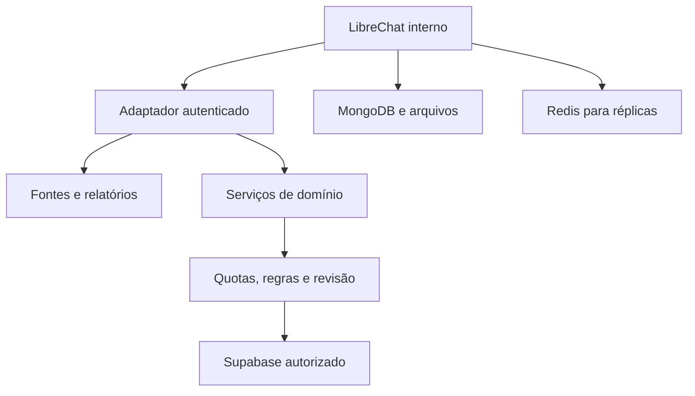

# LibreChat para o ecossistema Radar

Avaliação técnica e de produto em **01/10/2026**. Decisão: adotar como candidato a console interno de pesquisa e revisão, começando pelo **Radar de Teses e Riscos**. A implantação e as integrações continuam propostas; esta entrega cria o fork e documenta a avaliação.

## Escopo e evidência

- Código inspecionado: `LibreChat-AI/LibreChat`, `main`, commit `f10b1d91f1eee3a2c82d5247bf620351486b7c1b`; versão declarada `v0.8.8`.
- O release `v0.8.8` foi publicado em 01/10/2026 às 02:49 UTC e tem `prerelease: true` na API do GitHub. O nome sem `rc` não comprova homologação.
- Fork público: [ofelipepeixoto/LibreChat](https://github.com/ofelipepeixoto/LibreChat), com histórico, branches e licença preservados. A proposta de documentação parte de `dev`, seguindo `AGENTS.md`; ela não homologa o código adicional de `dev`.
- Foram examinados licença, manifests/lockfile, Compose, configuração, autorização MCP, ocultação de segredos, OAuth, saldo, armazenamento de streams e documentação de benchmarks. Foram lidos os READMEs dos projetos pessoais e a especificação de IA do Radar OaaS.
- Executado: `npm audit --package-lock-only --ignore-scripts --json`, Node `24.19.0`, npm `11.9.0`. Resultado no momento da consulta: **6 alertas baixos, 0 moderados, 0 altos, 0 críticos**. Os seis pacotes são afetados pela cadeia de `elliptic`, não seis falhas independentes. Exit code de auditoria com alertas não significa falha de execução.
- Não foram executados build, Jest, E2E, Lighthouse, benchmark de carga, pentest, chamadas de modelos, scan das imagens ou instalação em VPS. Não há capacidade de usuários, latência, qualidade ou custo real medidos para o Radar. Testes existentes no repositório não são testes aprovados nesta avaliação.

## Segurança, escala, inovação e desempenho

| Dimensão | Parecer | Evidência e condição |
| --- | --- | --- |
| Segurança | Piloto condicionado a configuração restrita | Há autenticação, permissões por recurso, ocultação de segredos MCP e defesa de rede. Ferramentas e conectores ampliam o acesso; habilitar só o necessário e testar isolamento com duas contas. |
| Escalabilidade | Arquitetura com caminho de expansão | Redis compartilha estado e streams; MongoDB persiste o núcleo. Réplicas exigem armazenamento de arquivos compartilhado, balanceador compatível com streaming e teste de falha/retomada. Capacidade de VPS não verificada. |
| Inovação | Boa base de infraestrutura, diferenciação no domínio | Agentes, MCP, múltiplos provedores, Skills, artefatos e revisão reduzem trabalho de plataforma. O diferencial Radar deve ser evidência rastreável, regras de domínio e entrega aceita, não o chat genérico. |
| Desempenho | Sinais positivos, homologação pendente | Streams retomáveis, coalescência Redis e benchmarks de interface estão implementados. Latência de modelos, contexto extenso, extração/RAG e concorrência podem dominar o tempo total. |

## Achados e ajustes necessários

### P1 — Configuração de exemplo exige endurecimento

`docker-compose.yml` e `deploy-compose.yml` usam imagens de desenvolvimento com `latest`; o código fixado nesta análise não fixa o conteúdo dessas imagens. Mongo usa `--noauth`; o vetor usa credenciais de exemplo; o painel tem cookie seguro desativado por padrão e expõe porta no Compose básico. Esses bancos não têm portas publicadas no Compose básico, portanto isso **não comprova exposição direta à internet**. O risco cresce com rede compartilhada, configuração alterada ou comprometimento de outro serviço.

Para piloto hospedado: override próprio, imagens fixadas por digest homologado, bancos autenticados em rede privada, segredos únicos, HTTPS, painel restrito, cookie seguro e cadastro por convite. `.env.example` usa `ALLOW_REGISTRATION=true`; CSP começa desativado. Revisar política CSP em relatório antes de aplicar bloqueios e testar artefatos/arquivos. Não executar o Compose de exemplo como aprovação de produção.

### P1 — Ferramentas precisam de autorização no serviço de destino

O controlador MCP aplica `redactServerSecrets`/`redactAllServerSecrets`; o helper exclui chaves e `client_secret`, e restringe URLs conforme edição. O registro resolve allowlists por contexto de usuário/tenant. OAuth tem fetch endurecido e testes de correspondência de recurso.

Há histórico público de falhas corrigidas, incluindo:

| Advisory | Versões declaradas afetadas | Correção declarada |
| --- | --- | --- |
| [GHSA-gvpj-vm2f-2m23](https://github.com/LibreChat-AI/LibreChat/security/advisories/GHSA-gvpj-vm2f-2m23): desvio de recurso OAuth MCP, risco de roubo de token | `<= v0.8.5-rc1` | `v0.8.5` |
| [GHSA-6vqg-rgpm-qvf9](https://github.com/LibreChat-AI/LibreChat/security/advisories/GHSA-6vqg-rgpm-qvf9): segredos de servidor compartilhado acessíveis a viewer | `v0.8.3` | `v0.8.4` |

Esses advisories não demonstram que as mesmas falhas persistem no commit avaliado. Exigem atualização acompanhada, regressão e gestão de conectores confiáveis. A lista acima é uma amostra verificada, não um inventário completo.

`librechat.example.yaml` informa que `toolApproval` é desativado por padrão. Para Radar, usar modo `default`, ferramentas de leitura explicitamente permitidas e alterações negadas até autorização específica. Não usar `bypass`, `dontAsk` ou Full access no piloto. A aprovação de uma chamada de ferramenta não equivale ao aceite final de relatório, assinatura ou comitê de dois revisores.

Um módulo encontrado em `packages/api/src/mcp/authority/README.md` declara que a prova adicional de autoridade é default-off e ainda não é chamada pelos fluxos existentes. Não contabilizá-la como proteção ativa. A autorização efetiva precisa ser testada nas rotas atuais e nos adaptadores, inclusive após revogação de permissão.

Instruções de fontes, documentos e respostas de ferramentas são conteúdo não confiável. Prompt não concede acesso: o adaptador deve derivar identidade da sessão, validar propriedade do recurso e limitar operação. Nunca fornecer shell, Docker socket, chave global do banco ou token administrativo do n8n ao agente.

### P1 — Créditos não são orçamento monetário de toda a operação

`balanceSchema.enabled` é `false` por padrão; transações são habilitadas por padrão. `checkBalance.ts` reserva créditos enquanto a chamada está em andamento, protegendo admissões concorrentes. No caminho de `BaseClient.js` inspecionado, a reserva é calculada com **tokens do prompt** e multiplicador; não é reserva conservadora do custo total máximo de todas as saídas e ferramentas.

Habilitar saldo, configurar preços/limites por modelo e limitar contexto, saída, ciclos e concorrência. Busca, OCR, embeddings, execução e serviços MCP podem cobrar fora desse saldo. Para orçamento firme, o serviço de domínio deve reservar atomicamente o máximo permitido antes da execução, incluir as chamadas auxiliares e rejeitar sem saldo disponível. Alertas financeiros e flags de configuração não comprovam interrupção monetária pelo provedor.

No Radar de Teses e Riscos, preservar os limites e a revisão do `radar_lab`; um futuro adaptador deve chamar o serviço controlado, não reconstruir o fluxo livremente no chat. Consultar primeiro relatórios já aprovados. Acesso ao motor por API/MCP ainda precisa ser implementado.

### P2 — Dependências e componentes externos

O npm audit marcou `elliptic`, `browserify-sign`, `create-ecdh`, `crypto-browserify`, `node-stdlib-browser` e `vite-plugin-node-polyfills` como baixos, pela cadeia do [GHSA-848j-6mx2-7j84](https://github.com/advisories/GHSA-848j-6mx2-7j84). A alcançabilidade do uso criptográfico no produto não foi comprovada. Não executar `npm audit fix --force`: o fix sugerido altera versão principal de dependência e requer revisão/build.

RAG API e admin panel são imagens/componentes externos ao código avaliado. Examinar seus repositórios, SBOMs, imagens, autenticação e retenção antes de ativá-los. A licença MIT do LibreChat permite adaptação e uso comercial mantendo os avisos; fornecedores, modelos, componentes e marcas têm condições próprias.

## Arquitetura proposta

LibreChat mantém MongoDB para conversas, usuários e agentes. **Supabase não é substituto direto desse banco**. Os dados de negócio continuam nos serviços atuais; uma API estreita ou MCP autenticado faz a ponte. O RAG padrão acrescenta RAG API e PostgreSQL/pgvector; Meilisearch fornece busca de conversas. Redis é requisito documentado para múltiplas instâncias.

Diagrama de proposta, não infraestrutura implantada. O adaptador valida sessão, tenant/proprietário, payload, quota e tempo; seleciona campos mínimos e retorna IDs/fontes/status. Chamadas de alteração exigem autorização e idempotência no destino. Não aceitar `userId` ou tenant declarado pelo modelo como autoridade. Integração de identidade entre LibreChat e serviços existentes precisa de contrato próprio; não está pronta por ambos terem OAuth.

Em réplica, `createStreamServices.ts` pode cair para armazenamento em memória se a construção do serviço Redis falhar. Monitorar o backend efetivo e retirar réplica incapaz de compartilhar estado do tráfego, em vez de supor continuidade entre nós. Sessões compartilhadas não resolvem sozinhas uploads locais, persistência do job, compatibilidade entre versões ou retomada após morte do processo. Separar avaliação de alta disponibilidade da capacidade de escalar réplicas.

Começar com uma instância isolada e corpus sintético. O armazenamento de negócio autorizado do OaaS já compartilha recursos com outro projeto; não reaproveitar essa instância para histórico de chat, vetores ou novos schemas nesta entrega. VPS Hostinger é opção a verificar, não capacidade aprovada. Não hospedar o processo Node/Mongo inteiro no runtime Astro/Cloudflare do produto atual.

## Integrações priorizadas

| Projeto | O que existe/verificado | Melhoria proposta | Prioridade e limite |
| --- | --- | --- | --- |
| Radar de Teses e Riscos / TradingAgents | Lab em branch/PR, geração controlada e aprovação local; integração LibreChat ausente | Consultar relatórios aprovados e fontes por adaptador de leitura; depois avaliar execução com as quotas do lab | **P0, primeiro piloto**. Sem operação de investimento ou publicação. |
| Radar Disruptivo, monitor regulatório e Radar Jacarepaguá | Contexto fornecido na sessão; código desses sistemas não auditado aqui | Console editorial para organizar fontes, divergências e rascunhos revisáveis | **P1**. Preservar site e pipeline; não conceder autopublicação. |
| `skill-revisao-de-fontes` | Skill e validador estrutural; validador não pesquisa nem comprova verdade | Adaptar instruções como Skill do agente e exigir referências verificáveis por alegação | **P1**. Portabilidade/runtime ainda precisa ser testada; inspeção estrutural não é fact-check completo. |
| `assistente-documental-ia`, `avaliacao-rag-juridico`, `laboratorio-busca-rag` | Protótipos de recuperação; o assistente documenta baseline limitado e geração sem avaliação publicada | Interface interna com corpus fictício; comparar recuperador existente e RAG do LibreChat pelo mesmo conjunto de reserva | **P1**. Avaliar abstenção, fonte correta e suporte semântico; não usar documentos reais no piloto. |
| `radar-oaas` | Astro/React, regras determinísticas, Supabase/RLS, endpoint `/api/analysis` e quotas próprias | Consultar snapshots autorizados e sugerir perguntas/experimentos; manter regras e revisão no produto | **P2**. Não alterar notas, pesos, travas ou transformar sugestão em evidência. UI guiada continua no Astro. |
| `agente-aprovacao-humana` | Exemplo Python local, registro em memória | Reaproveitar casos de recusa/repetição na avaliação; futuro serviço com identidade, persistência e auditoria | **P2**. O exemplo atual não é serviço de aprovação de produção. |
| Camaleão Growth + n8n | Planejamento/contexto da sessão; integrações não auditadas | Criar rascunhos de briefing e jobs delimitados por webhook autenticado | **P2**. Alterações externas somente com aprovação; credenciais mínimas, HMAC/expiração, deduplicação e sem acesso global. |
| `hermes-leilao-rj` | Aplicação local em modo sombra; sem identidade de revisores/Supabase operacional; aprovação final bloqueada | Eventual consulta somente leitura de memo exportado e anexos autorizados | **P3, depois dos gates próprios**. Preservar cálculo determinístico e bloqueios; sem lance, pagamento, login em leiloeiro ou aprovação final. |

As linhas marcadas como contexto não comprovam implantação atual. Nenhuma integração da tabela foi implementada por esta avaliação.

## Piloto e decisão de negócio

Cunha inicial: reduzir o trabalho para produzir **um relatório de tese e riscos aceito pelo editor**, com fontes e pendências claras. LibreChat é console de operação; a entrega vendável deve continuar definida pelo problema do cliente e pelo critério de aceite.

Experimento proposto, ainda não executado: 20 casos públicos/sintéticos, com execução manual de referência e execução assistida, mesma rubrica e revisão humana. Separar casos de desenvolvimento e reserva. Registrar tempo total até aceite, retrabalho, fontes corretas, alegações sem apoio, abstenção, tokens/custos auxiliares e falhas operacionais. Os 20 casos são um tamanho inicial proposto, não amostra estatisticamente validada.

Antes de habilitar clientes: todas as alegações factuais com referência ou incerteza explícita; zero ação proibida nos casos adversariais; isolamento comprovado entre duas contas; rejeição por quota sob concorrência; cancelamento e retomada sem duplicar efeito; export somente com aprovação válida. Ganho de tempo deve ser medido incluindo revisão e correção, sem piorar a rubrica de qualidade. Definir o teto financeiro e a margem desejada antes da primeira chamada paga, a partir dos preços verificados na implantação.

Economia por entrega aceita = modelos + busca/OCR/embeddings/ferramentas + parcela de infraestrutura + revisão humana + retrabalho + suporte. Receita e margem continuam desconhecidas. Não contratar infraestrutura maior por contagem de estrelas ou demonstração de chat.

Plano de capacidade: medir carga com 1, 5 e 10 sessões simultâneas em ambiente descartável, primeiro com inferência simulada e depois com modelo autorizado. Medir p50/p95 de entrada até primeiro token, até término e até relatório aceito; erros, cancelamento, memória, CPU, conexões, filas e custo. Reproduzir benchmark de conversas longas e uploads limitados. Os níveis são cenários de teste, não capacidade prometida.

Reutilizar `e2e/lighthouse/README.md`: o gate upstream simula 250 ms por consulta Mongo e define LCP mediano de 4,5 s, CLS 0,1 e TBT 500 ms. São limites de laboratório documentados, não resultados medidos nesta entrega, percentis de produção ou promessa para a VPS.

Avançar após piloto com qualidade e economia observadas. Manter um fork próximo ao upstream: configurações, prompts e adaptadores pequenos; evitar reformar autenticação, persistência e interface inteira. A API de gestão de agentes é beta e workspaces são altamente experimentais; manter hooks de comandos, execução de código, plugins e agendamentos fora do primeiro piloto.

## Fontes e reprodutibilidade

- [Código avaliado, fixado por commit](https://github.com/LibreChat-AI/LibreChat/tree/f10b1d91f1eee3a2c82d5247bf620351486b7c1b)
- [Release v0.8.8](https://github.com/LibreChat-AI/LibreChat/releases/tag/v0.8.8) e [API do release](https://api.github.com/repos/LibreChat-AI/LibreChat/releases/tags/v0.8.8)
- [Segurança upstream](https://github.com/LibreChat-AI/LibreChat/security), [Redis](https://www.librechat.ai/docs/configuration/redis), [Agentes](https://www.librechat.ai/docs/features/agents)
- [Saldo](https://www.librechat.ai/docs/configuration/librechat_yaml/object_structure/balance), [configuração MCP](https://www.librechat.ai/docs/configuration/librechat_yaml/object_structure/mcp_servers)
- [Radar OaaS: contrato e limites de IA](https://github.com/ofelipepeixoto/radar-oaas/blob/3c0581c0e2997879c2830926caad1ebbf6f4ef01/docs/ai.md)

Snapshots pessoais consultados: `radar-oaas` `3c0581c0e2997879c2830926caad1ebbf6f4ef01`; `assistente-documental-ia` `22b96bd90bde737cfc5974f0c5d73cf1529f0c73`; `hermes-leilao-rj` `f608d45c5b95781b776020ae433c001c44e32caa`; `agente-aprovacao-humana` `a39ccd71ede3a143e10f72b25e3c3860b1a9a1f4`; `avaliacao-rag-juridico` `81da91ef5e744aced9310e33058dad667caa7b03`; `skill-revisao-de-fontes` `14bebdb77b82c4f283e20d3a88152f03306a8899`.

A evidência da auditoria de dependências está em `npm-audit-summary.json`. Reexecutar a auditoria: a base de advisories muda. Preservar os avisos MIT do upstream. Este relatório registra decisões e condições; não certifica segurança, qualidade jurídica/financeira ou disponibilidade operacional.
